# SCX Architecture Diagram

> Covers the full SCX (pacemaker-v2) system: AI agent → MCP server → forecast-backend → internal services → infrastructure.
> Tool groups are organised by rollout phase (read-only first, writes with confirmation, human-in-the-loop last).

```mermaid
flowchart TD
    Agent(["🤖 AI Agent\nClaude / Custom"])

    subgraph MCP["SCX MCP Server  ·  Node.js / TypeScript  ·  @modelcontextprotocol/sdk"]
        direction TB

        Creds["🔑 Credential Manager\nJWT via Keycloak Client Credentials flow\nAPI Key  ·  Tenant ID mapping\nCredentials never exposed to agent"]

        subgraph Phase1["Phase 1 — Read-only  (zero risk)"]
            direction LR
            GA["Group A · Forecast Intelligence\nlist_configurations · get_forecast_series\nget_accuracy_measures · get_portfolio_totals\nget_abc_xyz_analysis · get_prediction_explanation\n10 tools  ·  JWT"]
            GB["Group B · Replenishment Risk\nget_critical_stock · get_stock_alert_summary\nget_material_forward_plan · get_safety_stock_days\nget_stock_development · get_data_freshness\n6 tools  ·  JWT"]
            GF["Group F · Commodity Pricing\nlist_commodity_materials · get_commodity_summary\nget_commodity_price_trend · get_hedging_recommendation\nget_commodity_news\n5 tools  ·  JWT"]
        end

        subgraph Phase2["Phase 2 — Write + User Confirmation"]
            direction LR
            GC["Group C · Forecast Execution\nexecute_forecast\nTriggers async job · subscribes SSE · returns result\n1 tool  ·  JWT or API Key"]
            GE["Group E · Event Injection\nget_extraction_topics · list_events\ncreate_event · import_extracted_events\n4 tools  ·  JWT + API Key"]
        end

        subgraph Phase3["Phase 3 — Human-in-the-Loop"]
            GD["Group D · Consensus Workflow\nget_consensus_dimensions · get_consensus_prediction\nget_consensus_history · reconcile_forecast\n4 tools  ·  JWT  ·  explicit approval required"]
        end
    end

    subgraph FB["forecast-backend  ·  NestJS  ·  /api/v1/  ·  ~120 endpoints  ·  Multi-tenant via CLS"]
        direction TB

        MW["AuthGuard → CompanyAttachment → TenancyService CLS\nJWT Bearer  or  x-api-key  ·  per-tenant DB routing"]

        subgraph APIs["API Domains"]
            direction LR
            ForecastAPI["Configurations & Results\n/configurations/**\n/results/**\n/forecasts/**\n/export/**"]
            InsightsAPI["Insights & Analytics\n/insights/**\n/analysis/**\nPortfolio · YoY · ABC-XYZ\nPlanning accuracy"]
            ReplenishAPI["Replenishment\n/replenishment/**\nCritical stock · Forward plans\nSales history\ndata from Snowflake"]
            ConsensusAPI["Consensus Planning\n/consensus/**\nPredictions · Reconciliation\nHistory & audit logs"]
            EventsAPI["Events & NLP Extraction\n/events/**\n/event-extraction/**\nAPI Key auth for import"]
            CommodityAPI["Commodity Pricing\n/commodity-price/**\nLME data · Hedging calc\nPrice news"]
            AdminAPI["Admin & System\n/admin/**  /feature-flags\n/datasource-info  /health/**"]
        end

        SSE["/sse/{tenantId}\nServer-Sent Events\nJob progress · Export status\nBacked by Redis pub/sub"]
    end

    subgraph IntSvc["Internal Services  (not exposed as MCP tools — called by forecast-backend)"]
        direction LR
        Pipeline["forecast-pipeline\nPython · Internal REST · no auth\nARIMA · Prophet · XGBoost\nOpenAPI spec: forecast_pipeline_v1.yaml\n1 543 lines · complete"]
        Batch["batch-api\nAsync job queue\nPOST /submit_task\nGET /logs/{jobId}\nAuth: x-api-key"]
    end

    subgraph Infra["Infrastructure"]
        direction LR
        KC["Keycloak\nOIDC / OAuth2\nPer-tenant realms\nAdmin REST API"]
        PG[("PostgreSQL\nPer-tenant database\nSequelize + Umzug\nMigrations")]
        SF[("Snowflake\nReplenishment DWH\nPer-tenant schema\nPrivate key auth")]
        Redis[("Redis\nBullMQ job queue\nSSE relay\nCross-tab sync")]
        Blob["Azure Blob Storage\nExports · Uploads\nAnalysis results\nSAS URL downloads"]
    end

    %% ── Agent ↔ MCP ──────────────────────────────────────────────
    Agent <-->|"MCP Protocol\nstdio local dev / Claude Desktop\nStreamable HTTP production"| Creds

    %% ── MCP credential bootstrap ─────────────────────────────────
    Creds -.->|"Client Credentials flow\nPOST /realms/{realm}/protocol/openid-connect/token\ncache + refresh before expiry"| KC

    %% ── MCP tool groups → Backend API domains ───────────────────
    GA -->|"JWT"| ForecastAPI
    GA -->|"JWT"| InsightsAPI
    GB -->|"JWT"| ReplenishAPI
    GF -->|"JWT"| CommodityAPI
    GC -->|"JWT or API Key"| ForecastAPI
    GC <-.->|"SSE subscription\nasync job wait\n10 min timeout"| SSE
    GE -->|"JWT reads\nAPI Key import"| EventsAPI
    GD -->|"JWT"| ConsensusAPI

    %% ── Backend → Internal services ──────────────────────────────
    ForecastAPI -->|"Internal HTTP\nno auth"| Pipeline
    ForecastAPI -->|"x-api-key\nPOST /submit_task"| Batch
    Batch -.->|"job done event\npub to Redis"| Redis

    %% ── Backend → Infrastructure ─────────────────────────────────
    MW --> KC
    MW --> PG
    ReplenishAPI --> SF
    Redis -.->|"pub/sub\nSSE relay"| SSE
    FB --> Redis
    FB --> Blob
```



---

## Reading the diagram

| Layer | Description |
|-------|-------------|
| **AI Agent** | Claude or any MCP-capable client. Calls tools by name — never sees credentials or raw HTTP. |
| **MCP Server** | Holds credentials, injects tenant context, translates tool calls to REST, bridges async SSE into synchronous responses. |
| **forecast-backend** | The SCX NestJS REST API. AuthGuard + CLS middleware handle JWT validation and per-tenant DB routing on every request. |
| **Internal services** | `forecast-pipeline` (ML) and `batch-api` (job queue) — called by the backend, never by the MCP server directly. |
| **Infrastructure** | Keycloak (identity), PostgreSQL (per-tenant), Snowflake (replenishment DWH), Redis (queue + SSE), Azure Blob (files). |

## Phase rollout

```
Phase 1  →  Groups A · B · F   (read-only — zero mutation risk)
Phase 2  →  Groups C · E       (write operations — user confirmation before execute)
Phase 3  →  Group D            (consensus commits — explicit human approval required)
```

## Key patterns

- **Async jobs** (Group C): MCP triggers `POST /configurations/{id}/execute` → subscribes to `/sse/{tenantId}` → returns result synchronously to agent after SSE signals completion.
- **Event injection** (Group E): external news → LLM extracts events → agent proposes → human approves → `POST /event-extraction/import` (API Key) → optionally re-runs forecast.
- **Consensus** (Group D): agent reads current prediction → proposes override → human reviews in chat → `POST /consensus/reconciliation` with mandatory reason comment → agent verifies in history log.
- **Feature flag guard**: call `GET /feature-flags` at session start; gate commodity-price and replenishment tools on their flags being active for the tenant.
