# SMP Ecosystem Architecture Diagram

> Covers the full SMP ecosystem: PCI (Product Carbon Intelligence) + Waves Platform (SMP, Tax, CSRD, CFC, Tendering) + Serverless layer (AWS Lambda + Azure Functions).
> The MCP server is organised by product rather than by phase, because each product has a distinct domain and auth surface.

```mermaid
flowchart TD
    Agent(["🤖 AI Agent\nClaude / Custom"])

    subgraph MCP["SMP MCP Server  ·  Node.js / TypeScript  ·  @modelcontextprotocol/sdk"]
        direction LR
        Creds["🔑 Credential Manager\nJWT (Keycloak CC flow) per product\nAPI Keys: CFT · Tendering-API · TAXONOFY\nCredentials never exposed to agent"]

        subgraph ToolsPCI["PCI Tools  ·  GraphQL + SSE"]
            T_PCI["get_products · get_product_instance\ncalculate_pcf · trigger_supplier_emissions\nselect_emission_factor · ai_column_mapping\nget_pcf_portfolio · export_pcf_report\n8 tools"]
        end

        subgraph ToolsSMP["SMP / Fleet Tools  ·  REST JWT+APIKey"]
            T_SMP["get_shipments · get_tour_detail\nget_tour_emission_stats · list_vehicles\ncreate_booking · cancel_booking\nexport_shipments · get_invoice_report\n11 tools"]
        end

        subgraph ToolsCFT["CFT Tools  ·  REST AWS API Key"]
            T_CFT["calculate_transport_emissions\ncalculate_hub_emissions\n2 tools — pure calculation"]
        end

        subgraph ToolsTEN["Tendering Tools  ·  REST JWT + API Key"]
            T_TEN["list_orders · get_order_alternatives\ncalculate_leg_distance · calculate_leg_emission\nsubmit_order_batch · update_order_status\n7 tools"]
        end

        subgraph ToolsCFC["CFC Tools  ·  REST JWT"]
            T_CFC["get_carbon_entries · get_emission_factors\nget_report_results · get_activity_categories\nexport_report\n5 tools"]
        end

        subgraph ToolsCSRD["CSRD Tools  ·  REST JWT"]
            T_CSRD["list_csrd_indicators · get_indicator_values\nget_report_status · export_csrd_report\nget_materiality_analysis\n5 tools"]
        end

        subgraph ToolsTAX["TAX Tools  ·  REST JWT or x-api-key"]
            T_TAX["get_tax_activities · get_taxonomy_overview\nlist_eu_activities · export_taxonomy_report\n4 tools — TAXONOFY API preferred"]
        end
    end

    subgraph PCI["PCI — Product Carbon Intelligence  ·  NestJS + Apollo Federation v2"]
        direction LR
        GW["api-gateway\nApollo Federation Gateway\nGraphQL federation entry point\n:3000"]
        DM["data-management-api\nApollo Federation subgraph\nGraphQL :3001\nREST SSE /api/product-carbon-footprints\nREST exports · BOM proxy"]
        CFS["carbon-footprint-service\nNestJS BullMQ worker\n:3002\nAsync PCF calculation\nFetches emission factors"]
    end

    subgraph Waves["Waves Platform  ·  PHP 8.4 · Symfony 7.4 · API Platform 3.4.17  ·  Shared PostgreSQL + Azure Blob"]
        direction LR
        SMP_BE["waves-smp-backend\n:9529 · 179 endpoints\nFleet logistics\nBookings · Shipments · Tours\nVehicles · Tariffs · Invoices\nJWT Bearer + API Key"]
        TAX_BE["waves-tax-backend\nEU Taxonomy / TAXONOFY\nInternal JWT (Hydra)\nTAXONOFY public API (x-api-key)"]
        CSRD_BE["waves-csrd-backend\nCSRD compliance\nIndicators · Materiality\nIROs · Reports\nJWT Bearer"]
        CFC_BE["waves-cfc-backend\nCarbon accounting\nEntries · Reports\nActivities · Factors\nJWT Bearer"]
        TEN_BE["waves-tendering-backend\nTransport orders\nOrders · Legs\nDistance + emission calc\nJWT Bearer"]
    end

    subgraph Serverless["Serverless  ·  AWS Lambda  +  Azure Functions"]
        direction LR
        TEN_L["waves-tendering-api\nAWS Lambda · Python 3.12\nPOST /orders  POST /order\nDELETE /order/{id}\nAuth: x-api-key"]
        CFT_L["waves-cft\nAWS Lambda · Python 3.11\nPOST /cft — multimodal emission\nPOST /hubs — storage emission\nGLEC framework\nAuth: AWS API Gateway key"]
        MAP_AZ["waves-cft-mapping-sam-azure\nAzure Functions · HTTP trigger\nPython 3.9\n/tour  /tours  /vehicles\nManaged Identity + API Key"]
        EXC_AZ["waves-cft-parse-excel-azure\nAzure Functions · Blob trigger\nPython 3.9\nNot HTTP — event driven\nclient-ingress container → Service Bus"]
        CFT_TEN["waves-cft-tendering\nAWS Lambda · Python 3.8\nCompute only · no HTTP\nDirect Lambda invoke\nGLEC road/sea/air/rail"]
    end

    subgraph PCIInfra["PCI Infrastructure"]
        direction LR
        MongoDB[("MongoDB\nPrimary product DB")]
        PG_PCI[("PostgreSQL\nAnnual metrics")]
        Redis_PCI[("Redis\nBullMQ · SSE relay")]
        KC["Keycloak\nOIDC · JWT\nPCI + SMP-BE"]
    end

    subgraph WavesInfra["Waves Infrastructure"]
        direction LR
        PG_W[("PostgreSQL\nAll PHP backends\nDoctrine ORM")]
        Blob_W["Azure Blob\nSMP · Tax · CSRD\nCFC · Mapping"]
        S3_W["AWS S3\nTendering files"]
        SecMgr["AWS Secrets Manager\nwaves-cft\nwaves-tendering-api"]
        KeyVault["Azure Key Vault\nwaves-cft-mapping"]
    end

    subgraph External["External Services"]
        direction LR
        ORS["OpenRouteService\n+ Nominatim\nRouting & geocoding"]
        EFMS["EFMS\nEmission Factor\nMatching Service"]
        EcoT["EcoTransit SOAP\nTransport emissions"]
        SvcBus["Azure Service Bus\nTour message queue"]
        OAI["OpenAI\nCSV column\nmapping"]
    end

    %% ── Agent ↔ MCP ───────────────────────────────────────────────────
    Agent <-->|"MCP Protocol\nstdio (dev) / Streamable HTTP (prod)"| Creds

    %% ── MCP → PCI ─────────────────────────────────────────────────────
    T_PCI -->|"GraphQL POST\nJWT Bearer"| GW
    T_PCI <-.->|"SSE subscription\nasync PCF job wait"| DM

    %% ── MCP → Waves PHP ───────────────────────────────────────────────
    T_SMP  -->|"REST · JWT + API Key"| SMP_BE
    T_TAX  -->|"REST · x-api-key\nTAXONOFY API"| TAX_BE
    T_CSRD -->|"REST · JWT"| CSRD_BE
    T_CFC  -->|"REST · JWT"| CFC_BE
    T_TEN  -->|"REST · JWT"| TEN_BE
    T_TEN  -->|"REST · x-api-key"| TEN_L

    %% ── MCP → Serverless ──────────────────────────────────────────────
    T_CFT -->|"REST · AWS API Key"| CFT_L

    %% ── PCI internals ─────────────────────────────────────────────────
    GW --> DM
    GW --> KC
    DM --> CFS
    DM --> OAI
    DM --> MongoDB
    DM --> PG_PCI
    Redis_PCI -.->|"BullMQ jobs"| CFS
    CFS --> EFMS
    CFS --> EcoT
    CFS --> Redis_PCI

    %% ── Waves cross-system ────────────────────────────────────────────
    CSRD_BE -.->|"GET /api/companies/{id}/address"| SMP_BE
    TEN_BE  -->|"SMP Calculation API\nPOST /api/v1/calculate/emission\nPOST /api/v1/calculate/route-distance"| SMP_BE
    TEN_L   -->|"POST /cft\nemission per order leg"| CFT_L

    %% ── Serverless internals ──────────────────────────────────────────
    CFT_L   --> ORS
    CFT_L   --> SecMgr
    TEN_L   --> SecMgr
    MAP_AZ  --> KeyVault
    MAP_AZ  --> CFT_L
    EXC_AZ  -.->|"Blob trigger\none message per tour"| SvcBus

    %% ── Waves infra ───────────────────────────────────────────────────
    SMP_BE  --> PG_W
    SMP_BE  --> Blob_W
    SMP_BE  --> KC
    TAX_BE  --> PG_W
    TAX_BE  --> Blob_W
    CSRD_BE --> PG_W
    CSRD_BE --> Blob_W
    CFC_BE  --> PG_W
    CFC_BE  --> Blob_W
    TEN_BE  --> PG_W
    TEN_BE  --> S3_W
```

---

## Reading the diagram

### Product clusters

| Cluster | Stack | Auth |
|---------|-------|------|
| **PCI** | NestJS + Apollo Federation v2 + BullMQ | JWT (Keycloak) forwarded through Apollo Gateway |
| **Waves Platform** | PHP 8.4 + Symfony 7.4 + API Platform 3.4.17 | JWT (`lexik/jwt-auth`, shared `JWT_PUBLIC_KEY`) · waves-smp also accepts API Key |
| **Serverless** | AWS Lambda (Python 3.11–3.12) + Azure Functions (Python 3.9) | AWS API Gateway key · x-api-key · Azure Managed Identity |

### Cross-system integrations (dashed lines inside backends)

| From | To | Why |
|------|----|-----|
| `waves-csrd-backend` | `waves-smp-backend` | Fetch company address for CSRD reports |
| `waves-tendering-backend` | `waves-smp-backend` (SMP Calculation API) | Distance + emission calc per transport leg |
| `waves-tendering-api` Lambda | `waves-cft` Lambda | Emission calculation per order leg (POST /cft) |
| `waves-cft-mapping-sam-azure` | `waves-cft` Lambda | Tour normalisation → emission calculation |
| `waves-cft-parse-excel-azure` | Azure Service Bus | Excel upload → structured tour messages (not HTTP) |

### Key async patterns

| Pattern | Where | How |
|---------|-------|-----|
| **PCF calculation** | PCI | GraphQL mutation `calculateProductCarbonFootprint` → BullMQ → carbon-footprint-service → MCP subscribes SSE at `/api/product-carbon-footprints/:id` |
| **Excel ingestion** | waves-cft-parse-excel | Blob trigger (not HTTP) → parse → Azure Service Bus → downstream tendering pipeline |
| **Order submission** | waves-tendering-api | Lambda invocation → internal call to waves-cft for emission → result stored to PostgreSQL |

### MCP tool priority

| Priority | Tools | Reason |
|----------|-------|--------|
| **Start here** | CFT `calculate_transport_emissions` | Pure calculation, stateless, smallest surface, API Key auth — fastest to implement and test |
| **High value** | Tendering `calculate_leg_emission`, SMP `get_tour_detail`, PCI `get_pcf_detail` | Read-heavy, clear agent use cases |
| **Write ops** | PCI `calculate_pcf`, Tendering `submit_order_batch`, SMP `create_booking` | Confirm with user before executing |
| **TAXONOFY API** | TAX export endpoints | Cleanest spec (`TAXONOFY_API.yaml`), plain JSON, API Key — easy codegen target |
