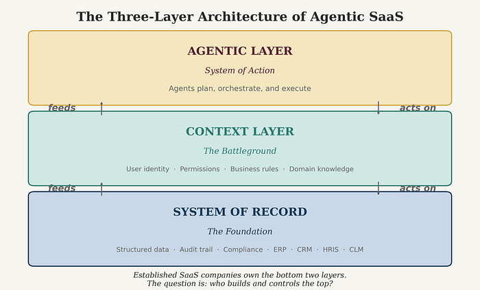
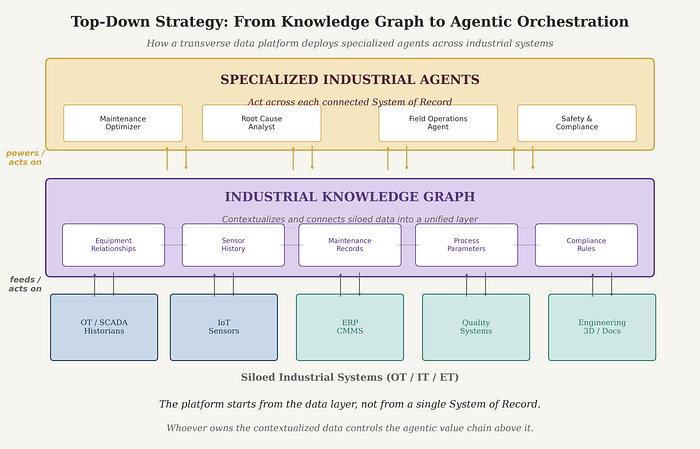

# Key Takeaways: Agentic AI Is a Massive Opportunity for B2B Software
*Cathay Capital, February 2026*

## 1. "SaaS is Dead" Is a Lazy Soundbite
- SaaS is a **business model** (subscription, recurring revenue), not a product or interface
- What's being disrupted is *how* SaaS is built: UI-first design, seat-based pricing, incremental roadmaps
- The business model itself is not dying

## 2. Systems of Record Are Not Dying — Agents Need Them
- Agents require structured data, permissions, compliance context, and business rules
- All of that lives in existing SaaS systems (ERP, CRM, HRIS, etc.)
- Three-layer architecture: **System of Record** (base) → **Context Layer** (middle) → **Agentic Layer** (top)

## 3. Established B2B SaaS Companies Have 5 Hard-to-Replicate Advantages
1. **Proprietary data** — years of structured customer data and domain-specific datasets
2. **Deep context** — user permissions, workflows, and decision patterns
3. **Domain expertise** — vertical knowledge generic LLMs cannot match
4. **Installed distribution** — existing customer base and enterprise trust
5. **Proven compliance** — SOC 2, audit requirements, data residency, regulatory credibility

## 4. A Fork in the Road for Every SaaS Company
- **Path 1 (Danger):** Do nothing → become "invisible plumbing," lose user relationship to third-party overlays, face pricing pressure and churn
- **Path 2 (Opportunity):** Build the agentic layer yourself → expand addressable market, capture new value

## 5. Four Types of Agents Are Emerging
| Type | Description | Example |
|------|-------------|---------|
| **Copilot** | Assists users within existing workflows | AI contract clause drafter in a CLM tool |
| **Wedge** | Owns a specific job end-to-end | Invoice-to-payment cycle agent in procurement |
| **Sentinel** | Continuously monitors data and flags issues | Brand compliance agent in a DAM |
| **Orchestrator** | Executes complex multi-step, multi-system workflows | Employee onboarding across HRIS, IT, and training |

## 6. It's a Race From Opposite Starting Points
- **Incumbents:** Own data and context, must build the agentic layer
- **Agentic-native startups:** Have speed and UX, must acquire data and compliance credibility
- Both are converging toward the middle — the winner becomes the **orchestration point** across the enterprise

## 7. Two Strategies for Cross-System Orchestration
- **Top-down:** Build a knowledge graph contextualizing data from multiple siloed sources, then deploy agents across connected systems
- **Bottom-up (Trojan Horse):** Enter via a lightweight, high-value agentic wedge with minimal IT footprint, then expand inward by connecting to core systems

## 8. What Must Change — Beyond the Product
- **Interface:** Agents (Copilot, ChatGPT, Slack) are the new primary interface; your product becomes a capability agents invoke
- **Pricing:** Shift from seat-based → outcome/usage-based hybrid models; price against value delivered, not API calls
- **Architecture:** Build personalized context layers, maintain LLM independence, expose capabilities via standards like MCP
- **Human-in-the-loop:** Enterprises won't trust fully autonomous agents on day one; embed human review into agent workflows

## 9. Culture and Leadership Are the Hardest Part
- *"AI is a leadership transformation problem first, and a tech problem second"*
- CEOs who don't personally use AI tools daily cannot credibly drive transformation
- AI intensifies work rather than simplifying it — organizational norms around AI use are a necessity
- Smaller, deeply AI-augmented teams outpace larger teams slowed by coordination overhead
- Physical proximity matters more, not less, as cognitive intensity increases

## 10. The Market Signal Is Real
- Salesforce: **$540M ARR** from AgentForce
- Intercom: **$200M+ ARR** driven by AI-first pivot
- Goldman Sachs deploying agents as *"digital co-workers for process-intensive professions"*
- Goldman Sachs estimates the total software market could reach **$780B by 2030**, with majority of incremental growth from agentic/AI-native layers

## 11. The Europe Opportunity
- More demanding regulatory environment = slower adoption by competitors
- European SaaS companies that move with urgency gain **first-mover advantage**
- Building within strict compliance frameworks produces battle-tested capabilities that matter globally

## 12. The Bottom Line
> Established B2B SaaS companies that combine strong Systems of Record, deep domain expertise, and the courage to transform their product, organization, and culture will create enormous value.

- The opportunity mirrors the on-premise → SaaS shift of the 2010s
- But the window to act is **shorter**, barriers to entry for challengers are **lower**, and the urgency is **greater**
- For companies and investors willing to do the work: *this is one of the best opportunities since the cloud transition itself*

